# YourTubeFlix - Video Streaming Platform

YourTubeFlix is a full-stack Django video streaming platform where users can sign up, upload and manage videos, and engage with content through likes, dislikes, and comments. It supports practical creator controls like public/private/unlisted visibility, soft-delete for comments, and personal video management (edit/delete), while also including moderation-oriented features such as reporting and admin review workflows. The site is built with a responsive Bootstrap 5 interface, uses django-allauth for authentication, supports ffmpeg-powered media handling, and is structured for both local development and production deployment with PostgreSQL/S3-ready configuration.

YourTubeFlix was created as part of a Capstone project for a Code Institute bootcamp.

The deployed website can be found here: [YourTubeFlix on Heroku](https://yourtubeflix-b9bff9094aa7.herokuapp.com/)

## Features

- 🎬 **Video Upload & Management** - Upload, edit, and delete videos
- 🔐 **User Authentication** - Sign up, login, and account management with django-allauth
- 👍 **Reactions** - Like/dislike videos
- 💬 **Comments** - Comment on videos with soft-delete functionality
- 🔒 **Privacy Controls** - Public, Private, and Unlisted visibility options
- 📱 **Responsive Design** - Mobile-friendly interface with Bootstrap 5
- 🎨 **Modern UI** - Gradient backgrounds and custom styling

## Technology Stack

- **Backend:** Django 6.0.2
- **Frontend:** Bootstrap 5, HTMX
- **Database:** SQLite, PostgreSQL
- **Authentication:** django-allauth
- **Video Processing:** ffmpeg

## Installation

### 1. Clone the repository

```bash
git clone https://github.com/steff657/Video-Streaming-Project.git
cd Video-Streaming-Project
```

### 2. Create a virtual environment

```bash
python -m venv venv
# On Windows
venv\Scripts\activate
# On macOS/Linux
source venv/bin/activate
```

### 3. Install dependencies

```bash
pip install -r requirements.txt
```

### 4. Setup environment variables

```bash
# Copy the example env file
cp .env.example .env

# Edit .env and set your configuration
# At minimum, set DJANGO_SECRET_KEY to a secure value
```

### 5. Run migrations

```bash
python manage.py migrate
```

### 6. Create a superuser (admin account)

```bash
python manage.py createsuperuser
```

### 7. Run the development server

```bash
python manage.py runserver
```

Visit `http://localhost:8000` in your browser.

## Project Structure

```text
Video-Streaming-Project/
├── core/                 # Main app
│   ├── migrations/       # Database migrations
│   ├── static/           # CSS, JS, images
│   ├── templates/        # HTML templates
│   ├── admin.py          # Admin configuration
│   ├── forms.py          # Form definitions
│   ├── models.py         # Database models
│   ├── urls.py           # URL routing
│   └── views.py          # View logic
├── yourtubeflix/         # Project settings package
│   ├── settings.py       # Django settings
│   ├── urls.py           # Main URL config
│   └── wsgi.py           # WSGI application
├── manage.py             # Django management script
├── requirements.txt      # Python dependencies
├── Procfile              # Heroku web process
├── runtime.txt           # Heroku Python runtime
└── .env.example          # Environment variables template
```

## Models

### Video

- `owner` - ForeignKey to User
- `title` - Video title
- `description` - Video description
- `tags` - JSON field for tags
- `visibility` - Public/Private/Unlisted
- `video_file` - Uploaded video file
- `thumbnail` - Auto-generated thumbnail
- `created_at` - Creation timestamp

### Comment

- `video` - ForeignKey to Video
- `user` - ForeignKey to User
- `comment_text` - Comment content
- `created_at` - Creation timestamp
- `is_deleted` - Soft delete flag
- `deleted_at` - Deletion timestamp

### Video Reaction

- `video` - ForeignKey to Video
- `user` - ForeignKey to User
- `value` - Like or Dislike
- `created_at` - Creation timestamp

## Database Schema

The diagram below is a snapshot of the current SQLite database structure for
this project. It highlights the primary application tables and the foreign key
relationships between user, video, comment, reaction, and moderation entities.

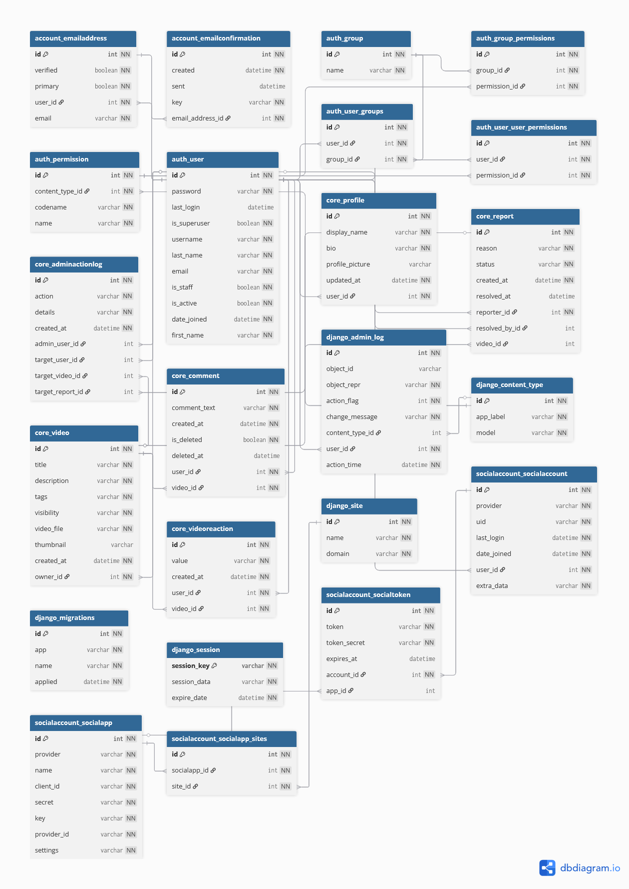

## API Endpoints

### Public

- `GET /` - Homepage
- `GET /video/<id>/` - View video detail
- `GET /search/` - Search videos
- `GET /u/<username>/` - View a public user profile
- `GET /accounts/` - Authentication pages

### Authenticated User

- `GET /upload/` - Upload page
- `POST /upload/` - Submit video upload
- `GET /my-videos/` - List user's videos
- `GET /video/<id>/edit/` - Edit video page
- `POST /video/<id>/edit/` - Submit video edits
- `GET /video/<id>/delete/` - Delete confirmation page
- `POST /video/<id>/delete/` - Delete video
- `POST /video/<id>/react/` - Like/dislike video
- `POST /video/<id>/comment/` - Post comment
- `POST /video/<id>/report/` - Report video
- `POST /comment/<id>/delete/` - Delete comment
- `POST /comment/<id>/edit/` - Edit comment
- `GET /me/profile/` - Edit current user profile
- `GET /me/account/` - Manage account settings

### Staff (Admin Tools)

- `GET /staff/users/` - User management
- `POST /staff/users/<id>/delete/` - Delete a user account
- `GET /staff/reports/` - Review reports
- `POST /staff/reports/<id>/resolve/` - Resolve a report
- `POST /staff/reports/<id>/delete-video/` - Delete reported video

## Configuration

Key settings in `.env`:

```ini
DEBUG=True                          # Set to False in production
DJANGO_SECRET_KEY=your-key-here    # Generate a secure key
ALLOWED_HOSTS=localhost,127.0.0.1
CORS_ALLOWED_ORIGINS=http://localhost:8000

MAX_UPLOAD_SIZE=524288000
ALLOWED_VIDEO_EXTENSIONS=mp4,mov,webm,mkv,m4v,avi,wmv,flv,mpg,mpeg,3gp,ogv,ts,m2ts
```

## Production Deployment

### Important Security Changes:

1. Set `DEBUG=False` in `.env`
2. Generate a secure `DJANGO_SECRET_KEY`
3. Set `ALLOWED_HOSTS` to your domain
4. Use PostgreSQL or another production database
5. Configure email backend for password resets
6. Use a production WSGI server (Gunicorn)
7. Configure HTTPS with SSL/TLS
8. Use environment variables for sensitive data
9. Use object storage for uploaded media files (Heroku disk is ephemeral)

### Deployment Example (Gunicorn + Nginx):

```bash
# Install production dependencies
pip install gunicorn whitenoise

# Run with Gunicorn
gunicorn yourtubeflix.wsgi:application --bind 0.0.0.0:8000
```

### Heroku Media Storage (S3)

Set these config vars in Heroku:

```bash
heroku config:set USE_S3=True
heroku config:set AWS_ACCESS_KEY_ID=...
heroku config:set AWS_SECRET_ACCESS_KEY=...
heroku config:set AWS_STORAGE_BUCKET_NAME=...
heroku config:set AWS_S3_REGION_NAME="your region"
```

Without external storage, uploaded files can disappear after dyno restart.

### Post-Deploy Health Check

Run this command after deployment to verify there are no pending migrations
and critical tables (`core_profile`, `core_video`, `core_report`) exist:

```bash
python manage.py check_deploy_health
```

On Heroku:

```bash
heroku run python manage.py check_deploy_health --app your-app-name
```

## Agile Methodology and User Stories

Project planning and progress tracking were managed in an Agile board
(Kanban style) using backlog, in-progress, review, and done columns.

### User stories implemented

All must-have user stories were implemented. One minor issue remains in the backlog for further investigation and a later fix.

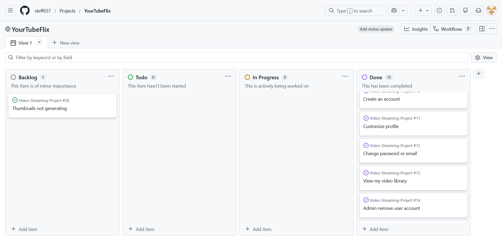

## UX Process

### Design approach

- Mobile-first layout with progressive enhancement for desktop.
- Clear information hierarchy: top navigation, searchable content grid,
  focused video detail page, and task-oriented forms.
- Consistent visual language based on Bootstrap plus custom site styles.

### Key UX decisions

- Added persistent login-state controls in the header/sidebar so users can
  always see account status and available actions.
- Prioritized discoverability with search and "Recently Uploaded" defaults.
- Reduced form friction with inline validation and clear field labels.
- Used responsive Grid/Flex patterns to keep layout functional on small screens.

### Accessibility notes

- Semantic page regions are used (`header`, `main`, article cards, form labels).
- Alternative text is provided for rendered profile/video images.
- Focus and input states are styled for keyboard users.
- Color palette aims for readable contrast in primary workflows.

## Wireframes

### Core and Account Screens


### Admin and Error Screens


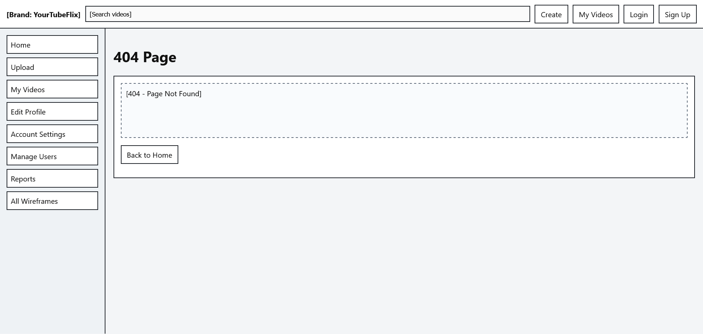

## Lighthouse Testing Snapshot

### Home Page Lighthouse Report Screenshot

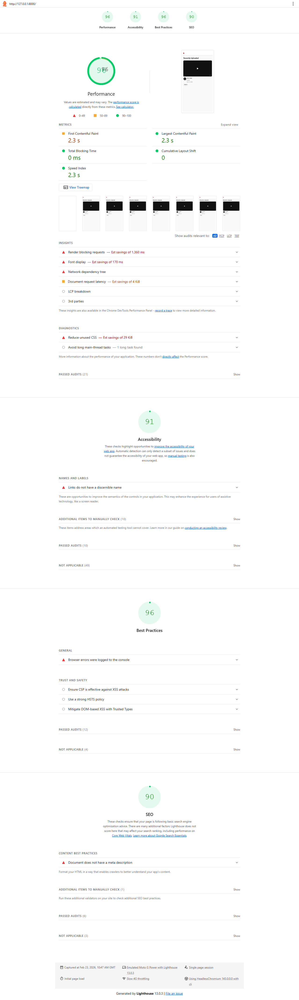

## Testing Documentation

### Test strategy

- Automated Django test coverage focuses on critical backend behavior:
  - Upload and media validation
  - Comment and interaction workflows
  - Profile and account update flows
  - Reporting and moderation paths
  - Guest access restrictions
  - Deployment health command execution
- Manual testing was performed to validate real user journeys, responsive
  rendering, and browser-level interaction behavior (navigation, uploads,
  reactions, comments, and admin workflows).

### Manual testing

Manual testing was conducted by the project owner with additional independent
checks by cohort peers and external users across different browsers and system
specifications.

Browser key: `S = success`, `F = fail`, `N/T = not tested`.


| Test                                        | Expected Result | Chrome | Firefox | Edge | Opera | Notes |
| --------------------------------------------- | ----------------- | -------- | --------- | ------ | ------- | ------- |
| Click Home menu                             | success         | S      | S       | S    | S     |       |
| Click About menu                            | success         | S      | S       | S    | S     |       |
| Click Browse/My Videos menu                 | success         | S      | S       | S    | S     |       |
| Click Upload menu                           | success         | S      | S       | S    | S     |       |
| Click Login menu                            | success         | S      | S       | S    | S     |       |
| Click Logout                                | success         | S      | S       | S    | S     |       |
| Open individual video detail page           | success         | S      | S       | S    | S     |       |
| Create, edit, and delete a personal comment | success         | S      | S       | S    | S     |       |
| Register new account                        | success         | S      | S       | S    | S     |       |
| Upload a new video                          | success         | S      | S       | S    | S     |       |
| Edit/Delete own video                       | success         | S      | S       | S    | S     |       |
| Access admin interface (staff only)         | success         | S      | S       | S    | S     |       |
| Responsiveness (mobile/tablet/desktop)      | success         | S      | S       | S    | S     |       |
| Flag video for moderation                   | success         | S      | S       | S    | S     |       |
| View reports                                | success         | S      | S       | S    | S     |       |

#### Manual Testing Evidence Screenshots

##### Code Quality Test Evidence

These screenshots document manual verification outputs for markup validity,
stylesheet quality, and Python code quality checks. Together they provide
evidence that frontend structure, styling rules, and backend code standards
were reviewed during testing.

###### CSS Code Test Results

This result captures the CSS validation/linting output used to verify style
consistency, rule correctness, and general maintainability of the stylesheet.

All warnings were minor (for example, color-contrast suggestions) or generated by vendor extensions. None of the reported issues affected the website functionality.


###### HTML Code Test Results

This result captures the HTML validation output used to confirm structural
correctness, semantic markup quality, and absence of critical document errors.


###### Python Code Test Results

This screenshot captures the PYLint output used to check code quality,
style compliance, and potential static issues in backend modules.


##### User and Account Flows

This set of checks validates onboarding and account management journeys, including
registration, authentication state changes, and profile/account maintenance.
The objective was to confirm that access controls, form validation, and user
settings behave consistently across supported browsers.

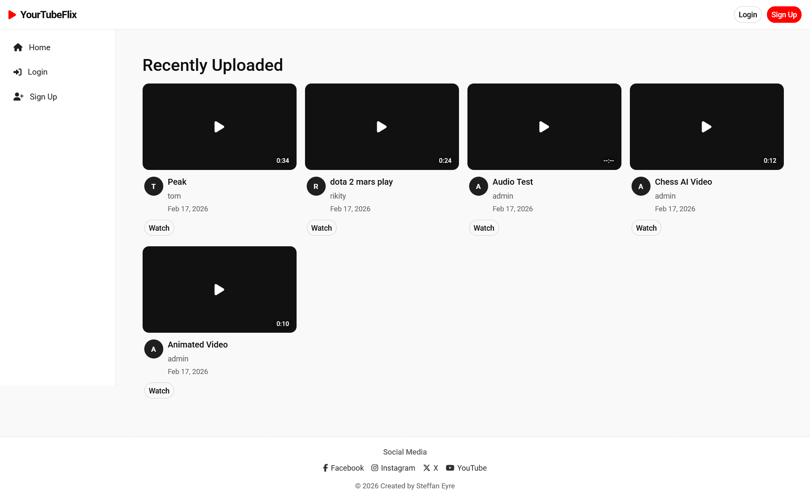

The registration screen was tested for required field validation, password
strength requirements, and email verification flow via SMTP configuration.


After successful account creation, authenticated navigation and permissions were
verified. This includes access to upload, profile editing, account settings,
and viewing existing public content.


Account Settings was tested to ensure users can safely update credentials such
as email address and password, with expected confirmation and validation behavior.


Edit Profile was validated for profile image upload, display name updates, and
biography edits, confirming persistence of changes and correct rendering on
profile views.


##### Video Workflows

This section covers the creator lifecycle from content management to playback
interaction. Tests focused on CRUD behavior, media validation, and user-facing
engagement actions.


Upload workflow testing confirmed form handling, media processing behavior, and
storage integration. Validation checks for file integrity, size, and resolution
were also exercised to confirm robust failure handling.


Video detail page testing verified playback, reaction controls (like/dislike),
and comment actions (create, edit, delete) under authenticated user permissions.


Delete flow testing confirmed that users can remove their own content through a
clear confirmation path and that removed items no longer appear in standard views.


Additional negative testing was carried out for upload integrity checks to
confirm invalid uploads are rejected with clear user feedback.


##### Admin and Moderation

Administrative and moderation workflows were tested to ensure flagged content
can be reviewed and resolved efficiently while maintaining role-based access
boundaries.

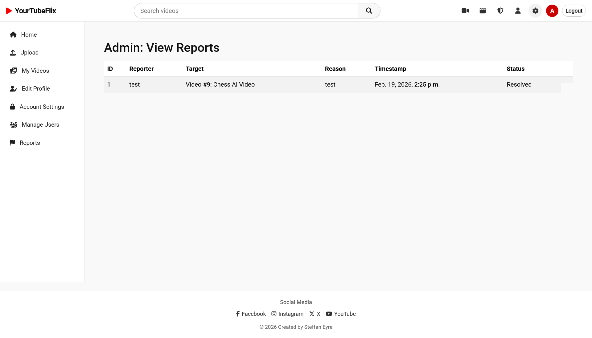

Admin home testing verified elevated navigation options, quick access to report
queues, and user-management entry points not available to standard users.


The Django admin panel was validated for core administrative operations, including
content oversight and account-level management actions.


Manage Users testing confirmed that administrators can inspect, update, and, when
required, remove user accounts in accordance with platform moderation policy.


##### Responsive Testing

Responsive behavior was tested across common viewport ranges (mobile, tablet,
and desktop) to confirm layout stability, readable typography, accessible
navigation, and functional form controls under different screen constraints.


| Check                       | Galaxy S9+ | Galaxy S5 | iPhone 6/7/8 | iPhone X | iPad | iPad Pro | Desktop 1024px | Desktop >1200px | Notes                                                    |
| ----------------------------- | ------------ | ----------- | -------------- | ---------- | ------ | ---------- | ---------------- | ----------------- | ---------------------------------------------------------- |
| Site is responsive >= 700px | n/a        | n/a       | n/a          | n/a      | Good | Good     | Good           | Good            | Uses horizontal overflow detection on emulated viewport. |
| Site is responsive < 699px  | Good       | Good      | Good         | Good     | n/a  | n/a      | n/a            | n/a             | Uses horizontal overflow detection on emulated viewport. |
| Links / URLs work           | Good       | Good      | Good         | Good     | Good | Good     | Good           | Good            |                                                          |
| Images work                 | n/a        | n/a       | n/a          | n/a      | n/a  | n/a      | n/a            | n/a             | No`` elements found on the tested pages.            |
| Renders as expected         | Good       | Good      | Good         | Good     | Good | Good     | Good           | Good            | No 5xx response and no runtime page errors.              |

Evidence screenshots:

- 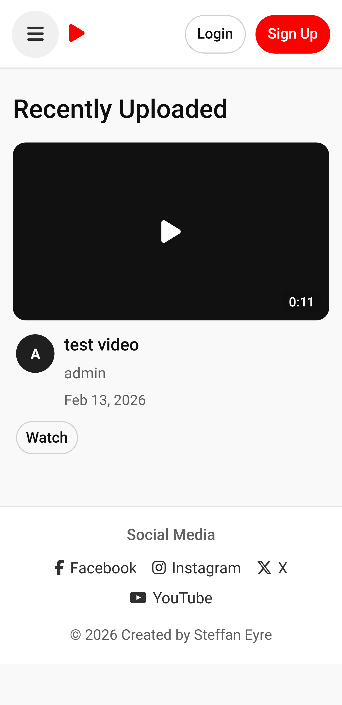
- 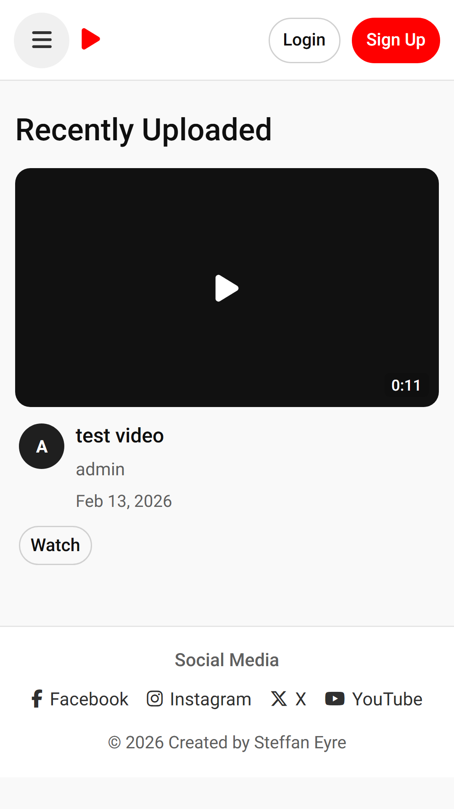
- 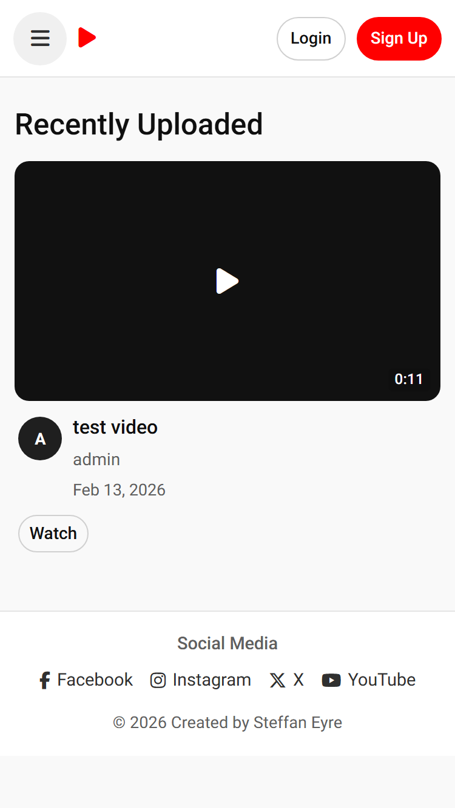
- 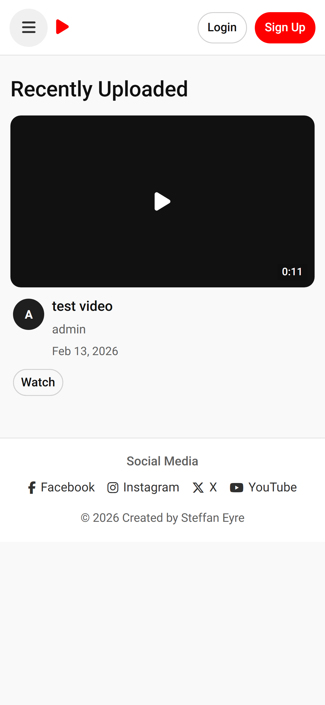
- 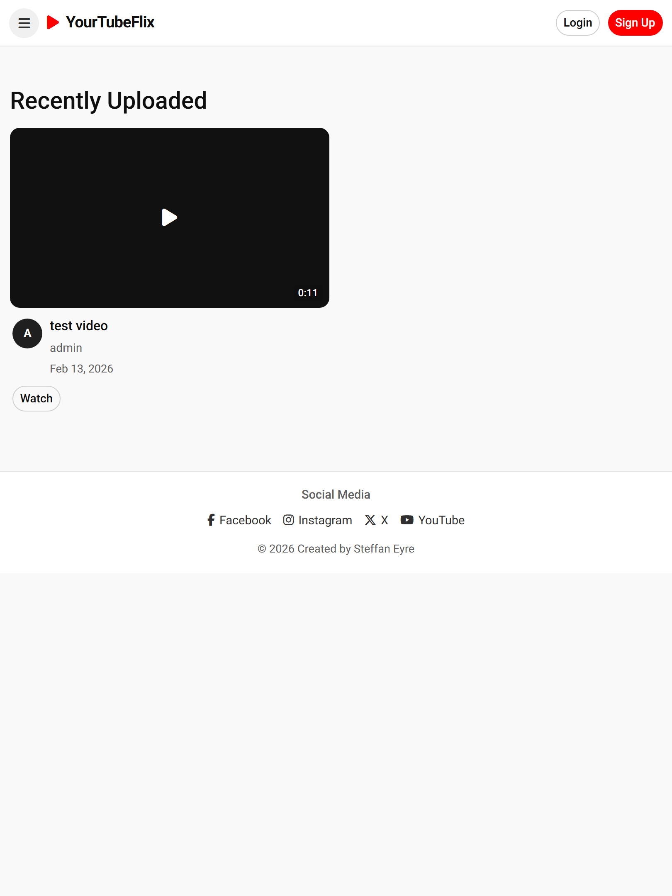
- 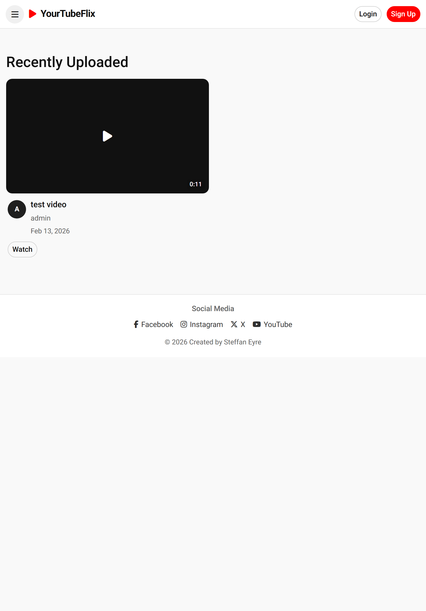
- 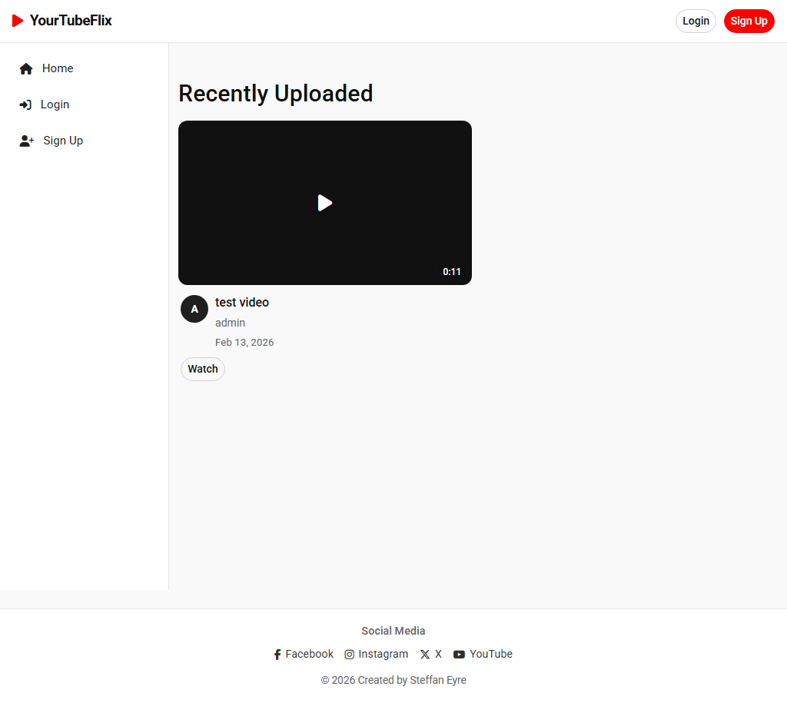
- 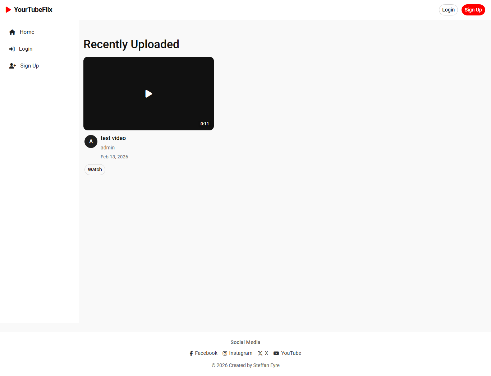

### Automated test execution

```bash
python manage.py test
```

Latest execution result:

- 15 tests collected and executed
- 15 passed
- 0 failed

### Deployment/security checks

The following checks were run to verify production readiness and deployment
consistency:

```bash
python manage.py check --deploy
python manage.py check_deploy_health
```

Iframe embedding is restricted through CSP `frame-ancestors` using
`EMBED_ALLOWED_ORIGINS` (default: `https://fireship.dev`).

## AI Usage Reflection

AI tooling was used as an engineering assistant for targeted implementation
and review tasks.

### Code creation

- Helped draft and refine CRUD-related view/form patterns and template logic.
- Assisted with structuring model constraints and validation flows.

### Debugging

- Helped identify edge cases in upload handling, auth flows, and moderation
  paths by suggesting focused checks.

### Performance and UX optimization

- Suggested improvements to reduce repeated work (query filtering patterns,
  concise view responses, and lightweight front-end updates).
- Supported responsive UI refinements and clearer feedback messaging.

### Workflow impact

- Improved development speed for repetitive scaffolding tasks.
- Kept focus on outcome quality by accelerating iteration and review.
- Final implementation and validation decisions were kept developer-led.

## Requirements for Features

- **FFmpeg/FFprobe:** Install for automatic thumbnail generation and resolution validation
  - Windows: `choco install ffmpeg`
  - macOS: `brew install ffmpeg`
  - Ubuntu: `apt-get install ffmpeg`
  - Heroku: add an `Aptfile` with `ffmpeg` and enable the apt buildpack:
    - `heroku buildpacks:add --index 1 heroku-community/apt`

## Troubleshooting

### Database errors

```bash
python manage.py migrate --run-syncdb
```

### Static files not loading

```bash
python manage.py collectstatic
```

### FFmpeg/FFprobe not found

- Ensure `ffmpeg` and `ffprobe` are installed and in your PATH
- Thumbnails are generated with ffmpeg if available
- Resolution validation is enforced with ffprobe if available

## Credits

- Code Institute: project structure expectations, assessment guidance, and
  capstone framework.
- Django documentation: framework configuration patterns, ORM usage, and
  deployment/security reference.
- django-allauth documentation: authentication and account flow integration.
- Bootstrap documentation: responsive layout and component usage.

## Content

- All written platform content (descriptions, labels, workflow copy, and test
  notes) was created for this project.
- Wireframe and process documentation text was authored specifically for the
  capstone submission workflow.

## Media

- Project UI screenshots and testing screenshots were captured from the running
  application.
- Wireframe images are stored in the `wireframes/` directory and represent the
  planned UI for core and admin workflows.
- Database and responsiveness diagrams/screenshots were generated as part of
  project testing documentation and are stored under `testing/`.
- Media files are user-owned, generated using OpenAI, or sourced from copyright-free websites.
- Alamy: https://www.alamy.com/

## Bugs and Fixes

The following issues were encountered during development and test-reporting
work, along with the steps used to resolve them.

1. Video upload failures on some formats

   - Issue: Initial upload flow failed for certain video inputs and edge-case encodings.
   - Fix: Upload validation and processing logic were updated, then stabilized with follow-up compatibility work.
   - Evidence: commits `a48b8e2`, `de0ad17`, `6f39859`, `7020143`.
2. Encoding compatibility regression

   - Issue: A compatibility patch introduced regressions for video processing.
   - Fix: The problematic change set was reverted, and safer processing improvements were introduced afterward.
   - Evidence: commits `cf6e018`, `2c42548` (reverts), followed by `d6c0a5b`/`917b314`.
3. AWS S3 storage usability issues

   - Issue: Cloud media storage behavior needed improvements for practical usage.
   - Fix: S3 integration and storage configuration were refined.
   - Evidence: commits `dcc5e5a`, `ec19a8d`.
4. Deployment instability and repeated deploy errors

   - Issue: Early deployment attempts produced repeated errors and reversions.
   - Fix: Environment handling, database settings, release migration command, and deployment checks were hardened.
   - Evidence: commits `5b6b613`, `8f5b468`, `e29897b`, `dd6c691`, `547dd07`, `3c4cd79`, `487d4b6`.
5. Local database and secret handling risk

   - Issue: Local DB tracking and weak secret-key handling required security cleanup.
   - Fix: Local DB tracking was removed and environment-driven secret management was strengthened.
   - Evidence: commits `cd6fb6d`, `7bb4212`, `05e437a`.
6. Authentication/access-control gaps

   - Issue: Some flows required tighter auth behavior and more resilient account handling.
   - Fix: Access restrictions were enforced on protected pages, and a resilient allauth adapter was added.
   - Evidence: commits `c8ba37b`, `6bb2f3c`.
7. Missing inline comment editing workflow

   - Issue: Comment editing was unavailable in the user interaction flow.
   - Fix: AJAX-powered comment editing was implemented.
   - Evidence: commit `029afa9`.
8. Mobile navigation/accessibility regression

   - Issue: A navigation style update introduced issues that required rollback.
   - Fix: The problematic mobile navigation change was reverted and replaced with improved accessible styling.
   - Evidence: commits `f56ab1a`, `0fbfc7d` (revert), `e5b8d3b`.
9. Iframe embedding security gap

   - Issue: Embedding controls were not explicit enough for moderation/security requirements.
   - Fix: CSP middleware with `frame-ancestors` control was added.
   - Evidence: commit `da8b5f7`.
10. Code-quality defects from static analysis

- Issue: PYLint surfaced style and maintainability issues.
- Fix: Lint findings were addressed and verification evidence was updated.
- Evidence: commit `e414991`.
